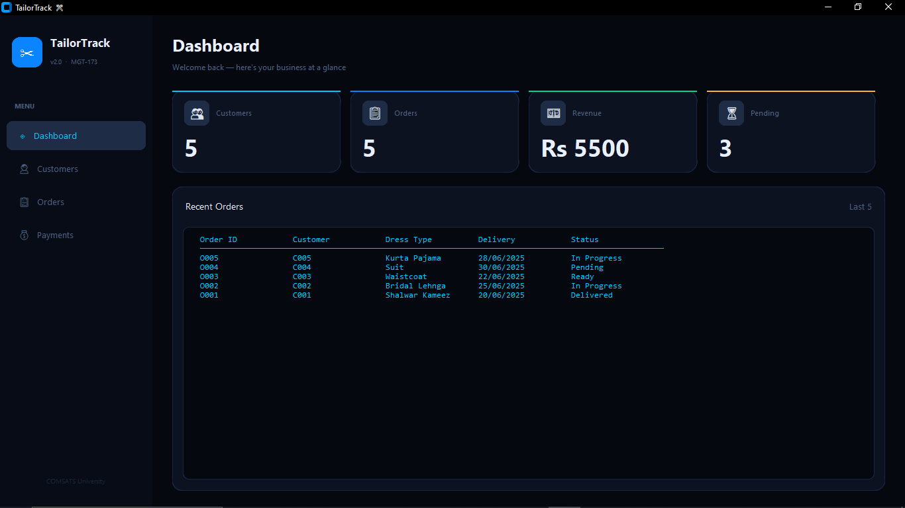
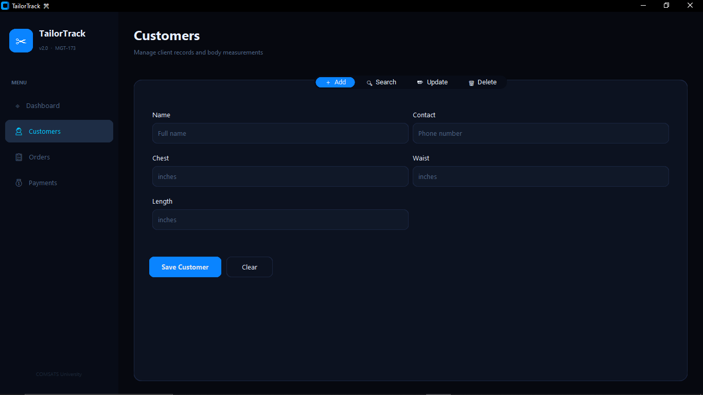
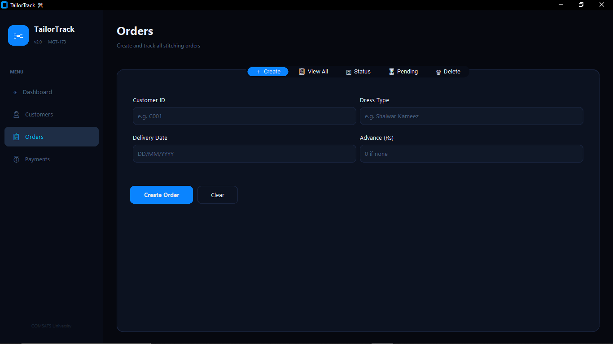
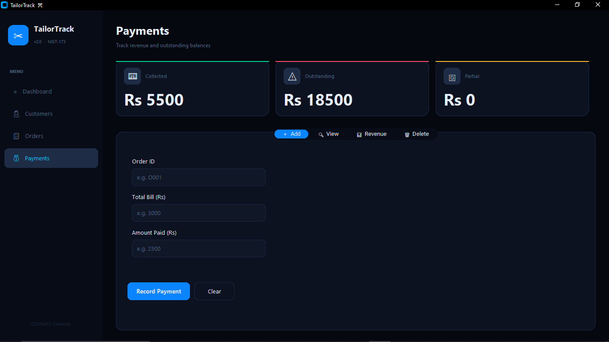

🧵 TailorTrack
 "Smart Order & Measurement Management System for Local Tailors" 

 


📌 Overview

TailorTrack is a Python-based Tailoring Management System developed to help tailoring businesses digitize their daily operations.

Instead of relying on paper registers, TailorTrack securely stores records digitally, making customer management faster, more accurate, and easier to maintain.


It provides a centralized digital system that enables tailors to:

- Store customer details
- Save body measurements
- Manage stitching orders
- Track delivery status
- Record payments
- View revenue summaries
- Search customer records instantly

The system simplifies day-to-day tailoring operations while reducing manual work and improving record accuracy.

✨ Key Features

| Module | Features |
|---------|----------|
| 👤 Customer Management | Add, Search, View & Update Customer Measurements |
| 🧵 Order Management | Create Orders, Track Orders, Update Order Status |
| 💳 Payment Management | Record Payments, View Payments, Revenue Summary |
| 📂 File Storage | Automatically saves records into text files |
| 🖥 GUI | User-friendly graphical interface using Tkinter |
| 💻 CLI | Fully functional command-line interface |
| ⚠ Error Handling | Prevents crashes on invalid user input |


🖥 Graphical User Interface (GUI)

The project includes a graphical interface built with **Tkinter** for users who prefer interacting through windows instead of terminal commands.

GUI Modules

- Home Dashboard
- Customer Management
- Order Management
- Payment Management
- Search Records
- Revenue Summary

💻 Command-Line Interface (CLI)

The CLI version provides a menu-driven system that allows users to perform all major operations directly from the terminal.

Main Menu

```
Customer Management
Order Management
Payment Management
Exit
```
Each section contains its own submenu for managing records.

Installation Steps

Run the CLI Version
Open
```
PL-(TaliorTracker).ipynb
```
Run all cells.

Run the GUI Version

1. Install the required library:

```bash
pip install customtkinter
```

2. Generate the sample data:

```bash
python sample_data.py
```

3. Launch the application:

```bash
python tailortrack_v2.py
```

📁 Data Storage

The application uses text files as lightweight databases.

- customers.txt
- orders.txt
- payments.txt

All records are stored automatically without hardcoding any data.


🛠 Technologies Used

| Technology | Purpose |
|------------|---------|
| Python | Core Programming Language |
| Tkinter | GUI Development |
| Object-Oriented Programming | Project Architecture |
| File Handling | Permanent Data Storage |
| Functions | Modular Programming |
| Dictionaries | Structured Data Handling |
| Lists | Data Storage |
| Exception Handling | Input Validation |


🏗 Object-Oriented Design

The project follows the principles of Object-Oriented Programming (OOP).

| Class | Responsibility |
|--------|----------------|
| Customer | Customer information and measurements |
| Order | Order creation and tracking |
| Payment | Payment records and revenue |
| FileManager | Reading and writing text files |

Screenshots of the dashboard





🚀 Future Improvements

- SQLite Database Integration
- User Authentication
- Invoice Generation
- SMS Order Notifications
- Email Delivery Reminders
- Search Filters
- Reports & Analytics Dashboard
- Cloud Data Backup


👩‍💻 Developer

Adeena Eman

GitHub: https://github.com/Adeenaeman

LinkedIn: https://www.linkedin.com/in/adeena-eman/

